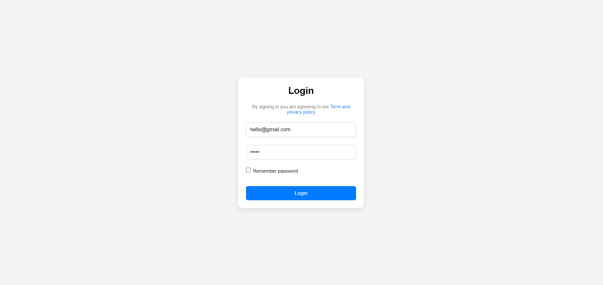
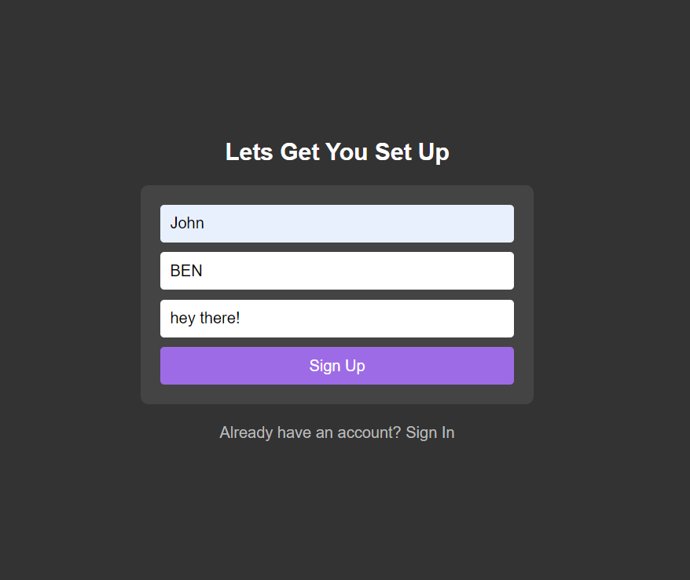
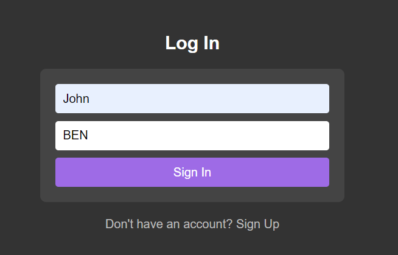
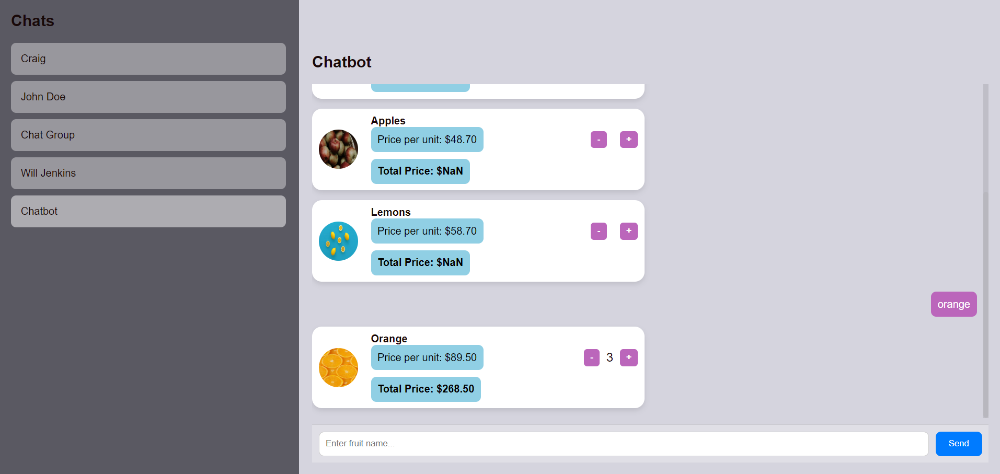

# Fruit.AI

Welcome to **Fruit.AI**! We aim to provide the best AI-powered solutions to make your life easier and healthier. Our services include real-time chat, translations, and more to help you stay connected and informed.

## Features

- **Login System**: 
  - Simple login interface with dummy credentials (`hello@gmail.com`, password: `hello`).
  - Redirects users to the homepage after successful login.
  
    
    

- **Chatbot**: 
  - A real-time chat where users can interact with a chatbot.
  - Displays a list of fruits in the form of cards, fetched from the database.
  - Users can select individual fruits to view detailed information.
     
     .png)
     
 

- **Translator**: 
  - Allows users to input text and translate it into regional languages.

- **FAQs Page**: 
  - Implements basic CRUD functionality to manage frequently asked questions.
  - Users can create, read, update, and delete FAQs related to fruits.
    

- **About Page**: 
  - Basic information about the Fruit.AI platform and its purpose.

## Tech Stack

- **Frontend**: React, HTML, CSS
- **Backend**: FastAPI (Python), MySQL
- **Styling**: Standard CSS for responsive, mobile-friendly design
- **Deployment**: 
  - Frontend: Deployed on =https://fruit-ai-frontend-1.onrender.com/
  - Backend: Deployed on https://fruit-ai-y36g.onrender.com/

## How to Use

1. **Login**: Use the dummy credentials `hello@gmail.com` and `password: hello` to log in.
2. **Navigate**: Once logged in, access services like Chat, Translator, FAQs, and About from the homepage.
3. **Chat**: Interact with the chatbot and explore available fruits and their details.
4. **Translate**: Enter text to translate it into a regional language.
5. **Manage FAQs**: Create, view, update, and delete FAQs related to fruits.

## Installation & Setup

### Prerequisites

- **Node.js** (for frontend)
- **Python 3.9+** (for backend)
- **MySQL** (for database)

## Setup Instructions

1. Clone the repository:

    ```bash
    git clone https://github.com/ishmeetjaggi/fruit.ai.git
  
    cd your-repo
    ```

### Frontend Setup

2. Navigate to the frontend directory:

    ```bash
    cd frontend
    ```

3. Install dependencies:

    ```bash
    npm install
    ```

4. Run the development server:

    ```bash
    npm start
    ```

5. To build for production:

    ```bash
    npm run build
    ```

### Backend Setup

6. Navigate back to the root of the repository and then to the backend directory:

    ```bash
    cd ../backend
    ```

7. Install backend dependencies:

    ```bash
    pip install -r requirements.txt
    ```

8. Run the backend server:

    ```bash
    uvicorn main:app --reload
    ```

## Deployment

- Frontend and Backend are deployed from the same repository.

- Deployment Link: [Deployed Link](#add-link-here)

## License

This project is licensed under the MIT License.

## Deployment

- Frontend: Deployed on https://fruit-ai-frontend-1.onrender.com/
- Backend: Deployed on https://fruit-ai-y36g.onrender.com/
## License

This project is licensed under the MIT License.


